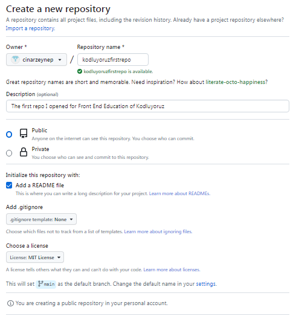

# Kodluyoruz First Repo
This repo is the first repo I created in Front End Education of Kodluyoruz. It contains a README file and an index.html.


## Installation
First clone the project. [Github](https://github.com/cinarzeynep/kodluyoruzfirstrepo)

`git clone https://github.com/cinarzeynep/kodluyoruzfirstrepo.git`

## Usage 
After cloning the project, open it in Visual Studio Code.

For Windows: 
```
cd kodluyoruzfirstrepo 
code .
```

## Contributing 
Pull requests are accepted. For major changes, please open a topic to discuss what you want to change first.

## Licence
[MIT](https://choosealicense.com/licenses/mit/)
